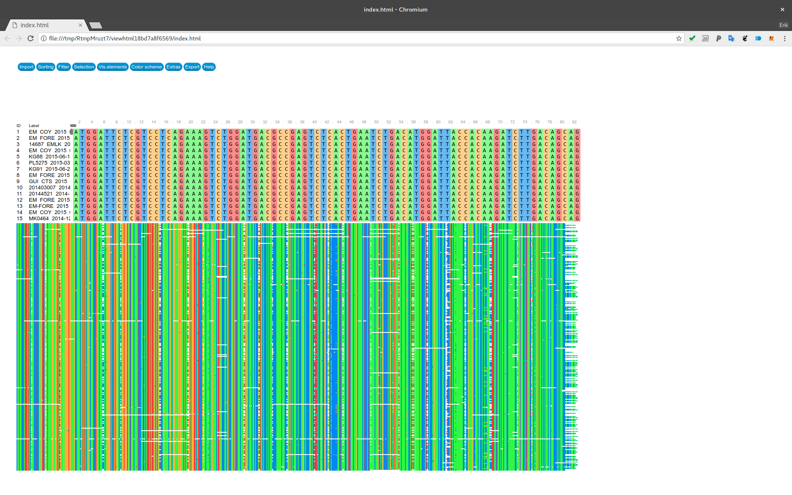
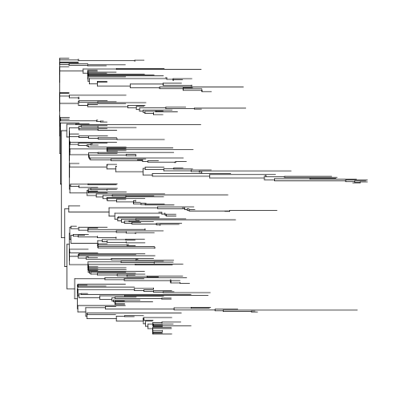
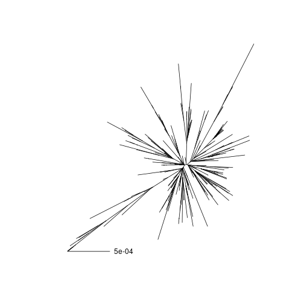
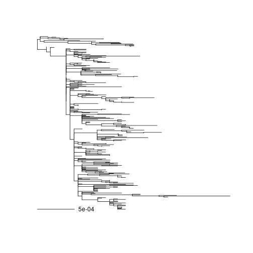
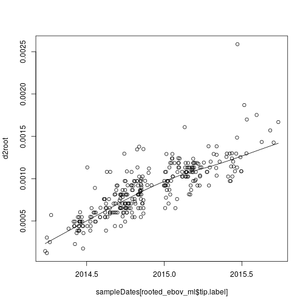
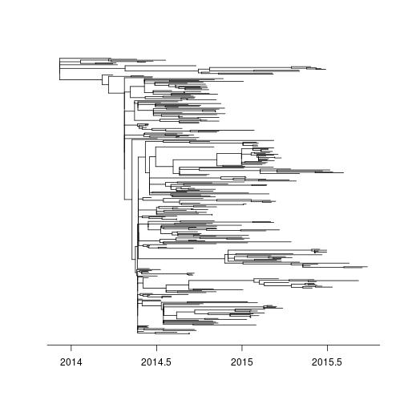
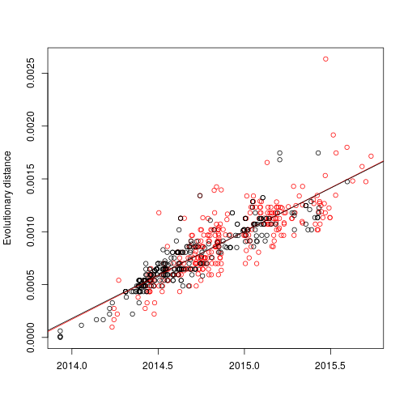
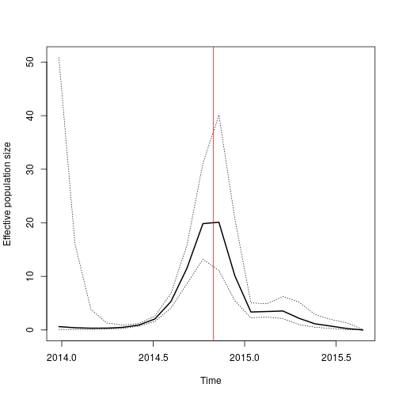
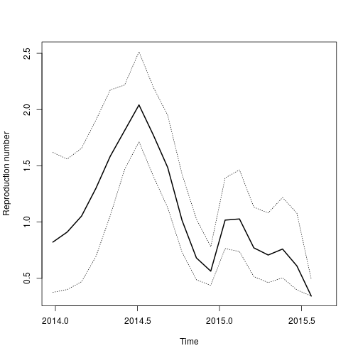
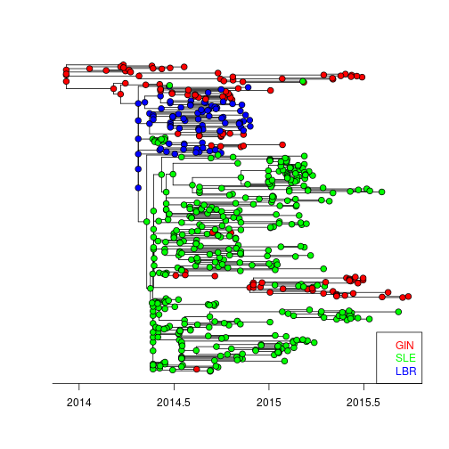

For the latest version, navigate to: 

[https://github.com/emvolz-phylodynamics/ebola2014-phylodynamicsPractical](https://github.com/emvolz-phylodynamics/ebola2014-phylodynamicsPractical)

# Exploratory phylodynamics of early EBOV epidemic in Sierra Leone

In this practical, we will re-analyse whole-genome EBOV sequences collected over the course of the 2013-2015 Ebola virus epidemic in Western Africa. 
The data and analysis were first described here: 

* [Dudas G. et al.(2017) _Virus genomes reveal factors that spread and sustained the ebola epidemic_, Nature, 544/7650: 309-15.](https://dx.doi.org/10.1038%2Fnature22040)

Details of the original analysis of these data [can be found here](https://github.com/ebov/space-time/tree/master/Data)

In the course of this practical you will learn how to

* load and view EBOV sequence data 
* estimate a phylogeny using neighbour-joining and maximum likelihood algorithms
* root a phylogeny using root-to-tip regression and estimate a molecular clock
* estimate time-scale phylogenies
* conduct non-parametric phylodynamic analyses an estimate the effective population size over the course of the epidemic
* extract and analyze 'meta-data' associated with each sequence such as the time of sampling and country of origin
* carry out ancestral state estimation to infer the likely location of lineages over the history fo the epidemic.

You will carry out this analysis on a random subset of the available sequences and your results will be unique. 
Make a note of the main results of your analysis:

1. Estimate the reproduction number in Siera Leone in mid-2014
2. Estimate when the epidemic peaked 
3. Estimate when the epidemic originated in humans
4. Estimate the country or origin of the epidemic 


## Installation and setup

For these analyses, we'll use the `ape` package for manipulating sequence and tree data, 
the `phangorn` package for estimating phylogenies and doing ancestral state estimation, 
the `treedater` package for estimating a molecular clock, and the 
`skygrowth` package for phylodynamic analysis. 

All of these packages are on CRAN and can be installed using `install.packages(...)` except for `skygrowth` which must be installed from github. 

If necessary, install the packages using 
```
if ( !require(phangorn) )
  install.packages('phangorn')
if ( !require(treedater))
  install.packages('treedater' )
```

Now we load the package as follows:

```r
suppressPackageStartupMessages( library(phangorn) ) # NOTE this also loads ape 
suppressPackageStartupMessages( library(treedater) )
```

Install and load `skygrowth` with the following:

```r
if (!require(devtools))
  install.packages('devtools') 
if (!require(skygrowth))
  devtools::install_github( 'mrc-ide/skygrowth' )

suppressPackageStartupMessages( library(skygrowth) )
```


## Loading and exploring the data

The original analysis by Dudas et al. was based on 1610 whole EBOV genomes. 
We will do a fast exploratory analysis of a random subsample of these sequences. 

Let's load the multiple sequence alignment and inspect it:


```r
ebov_algn <- read.dna('Makona_1610_cds_ig.fasta', format = 'fasta' ) 
ebov_algn
```

```
## 1610 DNA sequences in binary format stored in a matrix.
## 
## All sequences of same length: 18992 
## 
## Labels:
## EBOV|MK2008|KU296526|SLE|WesternUrban|2015-02-12
## EBOV|MK2826|KU296405|SLE|Bombali|2015-03-08
## EBOV|KT5022|KU296519|SLE|WesternRural|2015-02-13
## EBOV|20524_EMLK|KU296424|SLE|Kambia|2015-09-06
## EBOV|J0135|KP759602|SLE|WesternRural|2014-11-03
## EBOV|77524_EMLK|KU296368|SLE||2014-12-30
## ...
## 
## More than 10 million bases: not printing base composition
## (Total: 30.58 Mb)
```

Now we will create a unique sub-sample of these sequences. 
Since your results will be based on a different sample of sequences, your results will likely differ from what is presented here. 
You can try re-running your analysis with different subsamples and options. 

Choose a 'seed' for random number generation distinct from the `2014` value used here (for example, your CID number). Make a note of this number. Your results will be reproducible with this seed.

```r
set.seed( 2014 ) 
```

Sample the sequences: 

```r
n <- 300 # sample size
ebov_algn <- ebov_algn[ sample.int( nrow(ebov_algn), size = n, replace=FALSE ), ]
ebov_algn
```

```
## 300 DNA sequences in binary format stored in a matrix.
## 
## All sequences of same length: 18992 
## 
## Labels:
## EBOV|EM_079413|KR817184|GIN|Gueckedou|2014-03-31
## EBOV|20142407|KR653249|SLE|Tonkolili|2014-10-16
## EBOV|G3770|KM233069|SLE|Kailahun|2014-06-12
## EBOV|EM_079910|KR817221|GIN|Gueckedou|2014-06-09
## EBOV|LIBR10072|KT725307|LBR|Montserrado|2014-09-20
## EBOV|EM_COY_2015_017664||GIN|Dubreka|2015-06-12
## ...
## 
## Base composition:
##     a     c     g     t 
## 0.319 0.214 0.198 0.269 
## (Total: 5.7 Mb)
```

It's always a good idea to visually check your alignment, which is easily done using an external tool like *seaview*.
If you like, you can also do this from within R using packages such as `msaR`. 
Note installation and visualization will take some time so you may skip this step. 

```
install.packages('msaR')
require(msaR)
msaR( ebov_algn )
```

This should open a browser window where you will something like the following: 



Let's compute genetic and evolutionary distances between sequences. This computes the raw number of character differences between each pair of sequences: 

```r
D_raw <- dist.dna( ebov_algn, model = 'raw' , as.matrix = T, pairwise.deletion=TRUE) * ncol(ebov_algn )
```

Note the option `pairwise.deletion=TRUE`, which causes missing data to be handled on a pairwise basis as opposed to masking sites across the entire alignment.
Let's make a histogram:
```
diag(D_raw) <- NA # don't count zero distances on diagonal
hist(D_raw)
```

There is a lot of variation in distances, with some pairs differing by less than two characters. This is due to the short time frame over which the epidemic spread and over which samples were collected.


## Evolutionary distances and a neighbour-joining tree

First, we will compute an evolutionary distance matrix for phylogenetic analysis. We will use the *F84* [nucleotide substition model](https://en.wikipedia.org/wiki/Models_of_DNA_evolution), which is similar to the HKY model that several published studies have found to work well for EBOV. 
This is different than computing the raw number of differences between sequences that we looked in the last section. 
The evolutionary model accounts for differential rates of substitution between different characters and also accounts for reverse-mutations and [saturation](https://en.wikipedia.org/wiki/Saturation_(genetic)).

```r
D <- dist.dna( ebov_algn, model = 'F84', pairwise.deletion=TRUE)
```
Using the `pairwise.deletion` option tells the distance calculation to ignore sites that are missing in one or both sequences when comparing two sequences, but sites which may be missing in other sequences are still used. 

Now computing a neighbor-joining tree is simple with the following command: 

```r
ebov_nj <- nj( D )
ebov_nj
```

```
## 
## Phylogenetic tree with 300 tips and 298 internal nodes.
## 
## Tip labels:
## 	EBOV|EM_079413|KR817184|GIN|Gueckedou|2014-03-31, EBOV|20142407|KR653249|SLE|Tonkolili|2014-10-16, EBOV|G3770|KM233069|SLE|Kailahun|2014-06-12, EBOV|EM_079910|KR817221|GIN|Gueckedou|2014-06-09, EBOV|LIBR10072|KT725307|LBR|Montserrado|2014-09-20, EBOV|EM_COY_2015_017664||GIN|Dubreka|2015-06-12, ...
## 
## Unrooted; includes branch lengths.
```

Let's plot it: 

```r
plot( ladderize(ebov_nj) , show.tip.label=F ) 
```



Note that there is **no** significance to the location of the root of this tree, and branch lengths show distances in units of substitions per site. 
We can plot an unrooted version with a scale bar:

```r
plot( ebov_nj , type = 'unr', show.tip.label=F) 
add.scale.bar() 
```




## Maximum likelihood phylogeny


First we convert the sequence data into a format recognized by `phangorn`:

```r
ebov_pd <- as.phyDat( ebov_algn ) 
```

Then set the initial conditions for optimization:

```r
fit_ini <- pml(ebov_nj, ebov_pd, k = 4, inv = .5, model = 'HKY')
```
This tells the package to start from the neighbour-joining tree and estimate 4 categories of rate variation with an HKY substitution model and to estimate the proportion of sites in the alignment which are invariant. 

Now we can optimize the tree topology and substitution model parameters.
These options specify which parameters should be optimized

* `optNni` specifies that the tree topology will be optimized using _nearest-neighbor interchange_ seearch
* `optBf` specifies that the base frequencies (A,C,T or G) will be estimated 
* `optQ` specifies that the substitution rate parameters will be estimated
* `optGamma` specifies that Gamma parameters for rate variation between sites will be estimated 
* `optInv` specifies that the proportion of sites which are invariant will be estimated

**Note**: This optimization can take a couple of minutes.

```r
fit <- optim.pml(fit_ini, optNni = TRUE, optBf = TRUE, optQ = TRUE, optGamma = TRUE, optInv=TRUE)
```

```
## optimize edge weights:  -36676.74 --> -36636.38 
## optimize base frequencies:  -36636.38 --> -36326.81 
## optimize rate matrix:  -36326.81 --> -35776.59 
## optimize invariant sites:  -35776.59 --> -35776.32 
## optimize shape parameter:  -35776.32 --> -35776.32 
## optimize edge weights:  -35776.32 --> -35776.3 
## optimize topology:  -35776.3 --> -35774.55 
## optimize topology:  -35774.55 --> -35765.44 
## optimize topology:  -35765.44 --> -35758.95 
## 23 
## optimize base frequencies:  -35758.95 --> -35758.66 
## optimize rate matrix:  -35758.66 --> -35758.64 
## optimize invariant sites:  -35758.64 --> -35758.62 
## optimize shape parameter:  -35758.62 --> -35758.62 
## optimize edge weights:  -35758.62 --> -35758.62 
## optimize topology:  -35758.62 --> -35758.62 
## 0 
## optimize base frequencies:  -35758.62 --> -35758.62 
## optimize rate matrix:  -35758.62 --> -35758.62 
## optimize invariant sites:  -35758.62 --> -35758.62 
## optimize shape parameter:  -35758.62 --> -35758.62 
## optimize edge weights:  -35758.62 --> -35758.62
```

```r
ebov_ml <- unroot( fit$tree ) 
```

Let's see to what extent the optimized tree has higher likelihood than the initial neighbor-joining tree:

```r
anova(fit_ini, fit)
```

```
## Likelihood Ratio Test Table
##   Log lik.  Df Df change Diff log lik. Pr(>|Chi|)    
## 1   -36677 599                                       
## 2   -35759 607         8        1836.2  < 2.2e-16 ***
## ---
## Signif. codes:  0 '***' 0.001 '**' 0.01 '*' 0.05 '.' 0.1 ' ' 1
```

In the original analysis by Dudas et al., a more complex substitution model was used which accounted for differences in codon positions as well as in the non-coding regions. 


## Molecular clocks

To fit a molecular clock, we must use information about the time of each sample. 
Let's load the date of sampling for sequence. 
Note that the label for each sequence includes metadata regarding the province and country of origin and the time of sampling. 

```r
head( ebov_ml$tip.label )
```

```
## [1] "EBOV|EM_079413|KR817184|GIN|Gueckedou|2014-03-31"  
## [2] "EBOV|20142407|KR653249|SLE|Tonkolili|2014-10-16"   
## [3] "EBOV|G3770|KM233069|SLE|Kailahun|2014-06-12"       
## [4] "EBOV|EM_079910|KR817221|GIN|Gueckedou|2014-06-09"  
## [5] "EBOV|LIBR10072|KT725307|LBR|Montserrado|2014-09-20"
## [6] "EBOV|EM_COY_2015_017664||GIN|Dubreka|2015-06-12"
```

We load the sample times in numeric format using the following command: 

```r
sampleDates <- treedater::sampleYearsFromLabels( ebov_ml$tip.label, delimiter='|' )
```

Note the distribution of samples through time: 

```r
hist( sampleDates )
```


Most samples were collected in the latter half of 2014 when peak incidence occurred. 

Now we can construct a time-scaled phylogenetic tree so that branches are in units of years and nodes correspond to TMRCAs. 
Let's start by placing the root of the tree on a branch that is likely to have the MRCA of the sample. 
One way to do this is to use the `rtt` command, which uses root-to-tip regression; this selects the root position to maximise the variance in evolutionary distance explained by the tree. 

```r
rooted_ebov_ml <- rtt( ebov_ml, sampleDates )
plot( ladderize(rooted_ebov_ml) , show.tip.label=FALSE )
add.scale.bar() 
```



Lets do our own root-to-tip regression using the rerooted tree. 
You should find an almost linear trend between when evolutionary divergence and time that the sample was taken. 
This will also give us a rough estimate of the molecular clock rate.

```r
# the sample size 
n <- Ntip( rooted_ebov_ml )
# distance from root of the tree to each tip: 
d2root <- node.depth.edgelength( rooted_ebov_ml )[1:n] 
# a scatter plot with local regression line: 
scatter.smooth ( sampleDates[rooted_ebov_ml$tip.label], d2root ) 
```



Does this look approximately linear? 
The slope of a linear regression line will have units of substitutions per site per unit time and can serve as a fast estimator for the molecular clock rate. 

```r
rtt_regression <- lm( d2root ~ sampleDates[rooted_ebov_ml$tip.label] ) 
summary( rtt_regression )
```

```
## 
## Call:
## lm(formula = d2root ~ sampleDates[rooted_ebov_ml$tip.label])
## 
## Residuals:
##        Min         1Q     Median         3Q        Max 
## -3.660e-04 -1.019e-04 -1.702e-05  8.160e-05  1.240e-03 
## 
## Coefficients:
##                                         Estimate Std. Error t value
## (Intercept)                           -1.665e+00  6.660e-02  -25.01
## sampleDates[rooted_ebov_ml$tip.label]  8.270e-04  3.306e-05   25.02
##                                       Pr(>|t|)    
## (Intercept)                             <2e-16 ***
## sampleDates[rooted_ebov_ml$tip.label]   <2e-16 ***
## ---
## Signif. codes:  0 '***' 0.001 '**' 0.01 '*' 0.05 '.' 0.1 ' ' 1
## 
## Residual standard error: 0.0001797 on 298 degrees of freedom
## Multiple R-squared:  0.6775,	Adjusted R-squared:  0.6764 
## F-statistic:   626 on 1 and 298 DF,  p-value: < 2.2e-16
```

The molecular clock rate is the slope:

```r
coef( rtt_regression )
```

```
##                           (Intercept) 
##                         -1.6654967015 
## sampleDates[rooted_ebov_ml$tip.label] 
##                          0.0008270252
```

Estimates based on the state-of-the-art [Bayesian methods](http://epidemic.bio.ed.ac.uk/ebolavirus_evolutionary_rates) place the rate at around `.00124` substitions per site per year.


## Estimating times of common ancestry 

To estimate a tree with branch lengths in units of time (and TMRCAs), we will use the recently-developed `treedater` R package which is based on 

*  E. M. Volz, S. D. W. Frost; [Scalable relaxed clock phylogenetic dating](https://doi.org/10.1093/ve/vex025), Virus Evolution, Volume 3, Issue 2, 1 July 2017, vex025

The `treedater` algorithm requires as input a tree with branches in units of substitutions, the sample times for each tree tip, and the length of the sequences used to estimate the tree. 
This package can estimate the root position if given an unrooted phylogeny, or we can re-use the estimated root position found with `rtt`. 
We use `treedater` like this: 

```r
# estimate the time scaled tree and root position: 
(ebov_td <- dater( ebov_ml, sampleDates, s = ncol(ebov_algn) ))
```

```
## Note: Minimum temporal branch length  (*minblen*) set to 0.00050045662100456. Increase *minblen* in the event of convergence failures. 
## Tree is not rooted. Searching for best root position. Increase searchRoot to try harder.
```

```
## 
## Phylogenetic tree with 300 tips and 299 internal nodes.
## 
## Tip labels:
## 	EBOV|EM_079413|KR817184|GIN|Gueckedou|2014-03-31, EBOV|20142407|KR653249|SLE|Tonkolili|2014-10-16, EBOV|G3770|KM233069|SLE|Kailahun|2014-06-12, EBOV|EM_079910|KR817221|GIN|Gueckedou|2014-06-09, EBOV|LIBR10072|KT725307|LBR|Montserrado|2014-09-20, EBOV|EM_COY_2015_017664||GIN|Dubreka|2015-06-12, ...
## 
## Rooted; includes branch lengths.
## 
##  Time of common ancestor 
## 2013.93234746265 
## 
##  Time to common ancestor (before most recent sample) 
## 1.80189911268894 
## 
##  Mean substitution rate 
## 0.000754415510341031 
## 
##  Strict or relaxed clock 
## relaxed 
## 
##  Coefficient of variation of rates 
## 0.253652695848432
```

Note that this provides an estimate of the clock rate, the variation in clock rates, and the time of common ancestry. 
Does your estimated TMRCA correspond to when this epidemic originated in humans? The [first documented case in humans](https://www.cdc.gov/vhf/ebola/history/2014-2016-outbreak/index.html) from this epidemic was in early December 2013. 

Let's visualise this tree: 

```r
plot( ebov_td, show.tip.label = FALSE )
axisPhylo(root.time = ebov_td$timeOfMRCA, backward = FALSE ) 
```



We can do an improved root-to-tip regression which also shows estimated dates at the interior of the tree using this command: 

```r
rootToTipRegressionPlot( ebov_td ) 
```



```
## Root-to-tip mean rate: 0.00083004142616812 
## Root-to-tip p value: 9.20001098861407e-75 
## Root-to-tip R squared (variance explained): 0.675280454048487 
## Returning fitted linear model.
```

By default `treedater` does not provide confidence intervals for estimated dates and rates, but we can do this quickly using a [parametric bootstrap](https://en.wikipedia.org/wiki/Bootstrapping_(statistics)#Parametric_bootstrap) procedure.
**Note**: This will take a couple minutes to run. 

```r
(ebov_pb <- parboot( ebov_td ) )
```

```
## Running in quiet mode. To print progress, set quiet=FALSE.
## NOTE: Running with overrideSearchRoot will speed up execution but may underestimate variance.
## NOTE: Running with overrideTempConstraint will speed up execution but may underestimate variance. Bootstrap tree replicates may have negative branch lengths.
```

```
##                            pseudo ML        2.5 %       97.5 %
## Time of common ancestor 2.013932e+03 2.013697e+03 2.014079e+03
## Mean substitution rate  7.544155e-04 6.249152e-04 9.107519e-04
## 
##  For more detailed output, $trees provides a list of each fit to each simulation
```
Does this confidence interval overlap with the earliest cases of EBOV in humans? This would be around 2013.95 in decimal format. 


## Nonparametric phylodynamic estimation 

We will reconstruct the historical dynamics of effective population size, Ne(t), using the nonparametric _skygrowth_ technique. For details, see 

* Erik M. Volz, Xavier Didelot; [Modeling the Growth and Decline of Pathogen Effective Population Size Provides Insight into Epidemic Dynamics and Drivers of Antimicrobial Resistance](https://doi.org/10.1093/sysbio/syy007), Systematic Biology, syy007

This 'effective' size may correspond approximately to the number of infected hosts ([although this assumption must be checked carefully](https://en.wikipedia.org/wiki/Viral_phylodynamics) ), and the growth rate of effective size can be used to estimate reproduction numbers. 


```r
# change the class of the treedater tree for input into skygrowth
ebov_td_phylo <-  ebov_td 
class(ebov_td_phylo) <- 'phylo'
```

Because geographic structure can confound the relationship between Ne(t) and epidemic size, we will work with a subtree drawing only on lineages sampled from the best sampled country, Sierra Leone. 
The set of lineages with geocode 'SLE' can be found using 

```r
sl_lineages <- ebov_td_phylo$tip.label[ grepl('SLE', ebov_td_phylo$tip.label ) ]
```
Now we want to make a new tree where all lineages but these are 'pruned': 

```r
sl_tree <- drop.tip ( ebov_td_phylo, setdiff( ebov_td_phylo$tip.label, sl_lineages )  )
```

Now we can estimate Ne(t) using Bayesian MCMC. 
**NOTE** This will take a couple minutes.  While you wait, have a look at [this figure](https://en.wikipedia.org/wiki/West_African_Ebola_virus_epidemic#/media/File:Ebola_cases.gif) and [these data](https://www.cdc.gov/vhf/ebola/history/2014-2016-outbreak/cumulative-cases-graphs.html) which show how many cases were reported to the WHO over time and in each country. 

```r
sg = skygrowth.mcmc ( sl_tree, res = 20 , quiet = TRUE )
```

Let's plot on the calendar time axis. According to WHO records, the peak number of cases in Sierra Leone (maximum number of cases per week) occurred on October 31, 2014. We include a vertical red line showing this time point. 

```r
# first we adjust the time axis so that is no longer years before most recent sample 
sg$time <- max(sampleDates) + sg$time 
plot( sg , logy=FALSE, ggplot = FALSE)
abline( v = 2014.83 , col = 'red')
```



Does your estimated time of peak Ne match that date?

We can also use these methods to get a rough idea of how the reproduction number changed through time, because the epidemic growth rate will sometimes be similar to the growth rate of Ne. 
If we assume that the EBOV infections  last 21 days on average (including incubation and clinical phases) than we can say that hosts are removed at the annualized rate of approximately 365/21. Then we can visualize R(t) using this command: 

```r
R.plot( sg, gamma = 365/21, ggplot = FALSE)
```



How does R(t) change through time? What was R(t) around the time the epidemic was growing rapidly in Sierra Leone (around 2014.5). 
Note that estimates may be very noisy and have large confidence intervals early on before rapid growth in Sierra Leone set in. 
How does this estimate of R(t) compare to [other published values](http://dx.doi.org/10.6084/m9.figshare.1381876) based on the early epidemic? 


## Ancestral state estimation 

Here we will use parsimony to reconstruct the likely location of lineages using the rooted time-scaled phylogeny. 
The country of origin (Liberia, Guinea, and Sierra Leone) can be found in the 4th position of each taxon label:

```r
head( ebov_td_phylo$tip.label, 1)
```

```
## [1] "EBOV|EM_079413|KR817184|GIN|Gueckedou|2014-03-31"
```
We can extract these geocodes using the `strsplit` command:

```r
cntry <- sapply( 
	strsplit( ebov_td_phylo$tip.label, '\\|' )
, '[', 4 ) 
names( cntry ) <- ebov_td_phylo$tip.label 
```
We can tabulate how many sequences come from each country (Guinea, Liberia, and Siera Leone): 

```r
table( cntry )
```

```
## cntry
## GIN LBR SLE 
##  60  44 196
```

Now we must put the geocodes in a `phyDat` format used in the `phangorn` package: 

```r
cntry_pd <- as.phyDat( cntry, type ='USER' , levels = unique( cntry ) )
```

Compute the ancestral states using

```r
cntry_ap <- ancestral.pars( ebov_td_phylo , cntry_pd ) 
```
And we can plot the states using the following: 

```r
plotAnc( ebov_td_phylo , cntry_ap , cex = .4 , show.tip = F)
axisPhylo(root.time = ebov_td$timeOfMRCA, backward = FALSE ) 
```




What country do you find at the root of the tree? 
The West African epidemic is though to have originated near [Gueckedou](https://en.wikipedia.org/wiki/Gu%C3%A9ck%C3%A9dou), a town in Southern Guinea which is quite close to the borders of both Sierra Leone and Liberia. 
The proximity of the original outbreak to three international border is though to have compounded the epidemic. By the Summer of 2014 Ebola was circulating in all three countries. 


## What next? 

If you still have time, there are many other things you can try 

* What sort of epidemic trajectories do you estimate using skygrowth and only sequences from Guinea or Liberia? 
* Can you do ancestral state estimation at the province level? Try doing this with just the most commonly sampled provinces. 
* What are the effects of the skygrowth smoothing parameter? Try values of `tau0` between .01 and 10
* What are the effects of assuming the HKY model on estimated dates and rates? What about between-site rate variation? 
* How does the quality of your estimates change if you reduce the sample size and/or remove earlier samples? Try this with the `drop.tip` command
